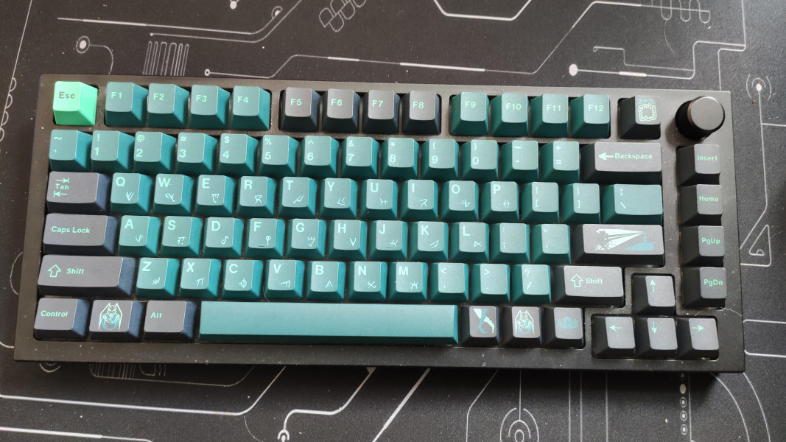

# GMMK Pro

:warning: I do not use this keyboard anymore, so this repo is probably out of date! :warning:

- US Layout (more or less...)
- The 2 Keys right of the spacebar switch to Layer 1 and 2
- Layer 1: RGB Control
- Layer 2: Makros for german umlauts using CapsLock as compose key
- Exta Features: CAPS_WORD by Pascal Getreuer
- Keys: Gazzew U4
- Keycaps: Some cheap ones from aliexpress
